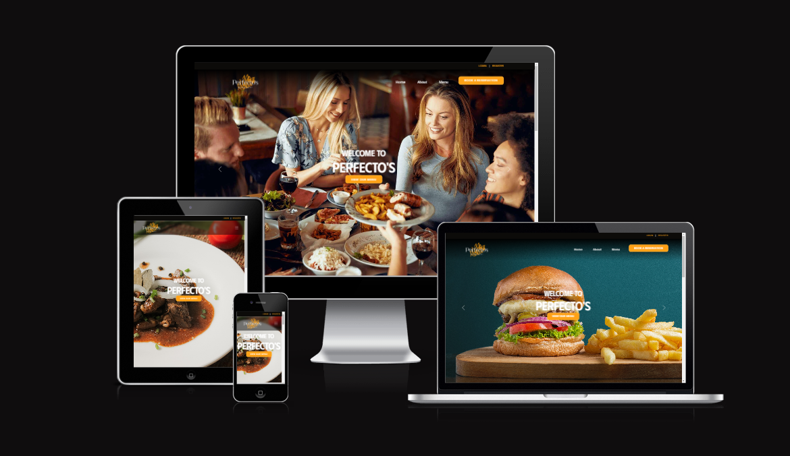
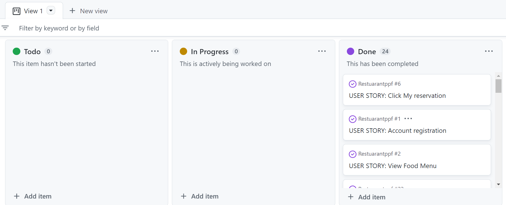
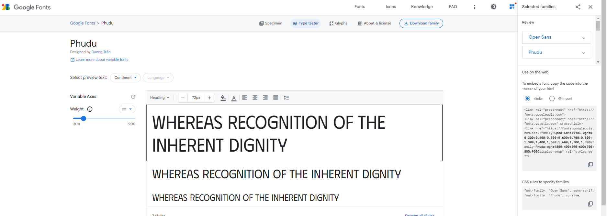

# Perfecto's Restaurant

Perfecto's Restaurant is the restaurant that serves the most delicious and famous all over the world. where you can eat Brunch because it is open from 10:00am-10:00pm. you can book thru online to reserve a seat or table.

The purpose of this Portfolio Project #4(Full Stack Project), this is part of me achieving the Diploma in Full Stack Software Development at [Code Institute](https://codeinstitute.net/).A Restaurant web page where Users can book or reserve a table.

[View live website here](https://myrestaurant2023.herokuapp.com/)

## Table of content
1. [Project](#project)
   - 1.1 [Objective](#objective)
   - 1.2 [Site Users Goal](#site-user-goal)
   - 1.3 [Site Owners Goal](#site-owners-goal)
   - 1.4 [Project Management](#project-management)
2. [User Experience](#user-experience)
   - 2.1 [Wireframes](#wireframes)
   - 2.2 [User Stories](#user-stories)
   - 2.3 [Site Stracture](#site-structure)
   - 2.4 [Design](#design)
      - 2.4.1 [Color scheme](#color-scheme)
      - 2.4.2 [Typography](#typography)
3. [Features](#features)
5. [Flowchart](#flowchart)
6. [Technology](#technology)
7. [Testing](#testing)
   - 7.1 Code Validation
   - 7.2 Fixed bugs
   - 7.3 Test cases
8. [Deployment](#deployment)
9. [Credits](#credits)

## Project

 

### Objective

Since I was a child, I love to cook and I learned this from my mother, I love to experiment with my dishes to have different flavors that are delicious. the idea of ​​the name Perfecto it is my grandfather's name which I love very much. and I want to build a restaurant one day with a variety of delicious dishes that are famous in different countries. this is my dedication to my grandfather and my dear mother.
 
 

### Site Users Goal

This restaurant will provide a unique experience and taste to those who love to eat and try different cuisines.
 
 

### Site Owners Goal

The purpose of the site owner is to deliver to users the website where they can eat Global Cuisine such as Japanese, Indian, German, American, and many others in this restaurant.
 
 

### Project Management

I used a project board as instructed in the module tutorial, but I haven't practiced using it much and I don't know what I should put in it. and due to my lack of time to do this project I won't be able to use it much because I'm always in a hurry, but in the next projects and if it's my time to do it full time I'm sure I'll be able to use it more and I'll be able to use it right
### Github Project Board

 
 

[Back to top](#table-of-content)

## User Experience

 

### Wireframes

 - I used balsamiq to create wireframes for my project.

   - [View wireframes here](https://balsamiq.cloud/s4lj2vf/pr3c5y)
 
 

### User Stories

- as a Site User:
   - I can register an account so that I can book a reservation.
   - I can login to my account using username and password so that the system can authenticate me.
   - I can view the list of food menu so that i can decide what i want to eat and make a reservation.
   - I can book a reservation to the website so that it is easy and fast.
   - I can choose the time and date so that i can be sure that i have a table on that day and time.
   - I can enter how many people I am with so that there are many. they can prepare a big table for us.
   - I can leave a note on my reservation so that i can say what my request are.
   - I can see that my reservation is successful or valid so that i can make sure that i have a reservation.
   - I can see the list of my booking so that I can see its details in case I forget it.
   - I can update my booking in case I entered a wrong detail I can change it.
   - I can see the validation when I cancel my booking so I'm sure it's canceled.
   - I can logout to my account so that no one else can use my site using my details.

- as a Site Admin:
   - I can create, read, update and delete bookings/reservations so that I can manage my restaurant booking system
   - I can prohibit double booking so that our operation is not disturbed and other guests can book.
 
 

[Back to top](#table-of-content)

### Site Structure

   
   - This website is divided into two parts, when the User is logged out and when the User is logged in. there is a slight difference here. that when the User is logged out it cannot book a reservation. but when the User is logged in User can book a reservation, view reservation, update, and cancel.
 
 

[Back to top](#table-of-content)

### Design

- In the design of my website I chose an appropriate font-color and font-style that is clear and easy to read by the User.
 
 

  - ### Typography
   

   - In this project I used only two font-styles. it is the Phudu and the Open sans. I used Phudu mostly for headers and Open sans for paragraphs and so on. I want to use only simple fonts and easy to read by the User.
   

typography screen shot

      
 

      

    
    
 
   - ### Color scheme
   

