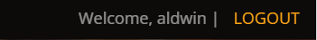

# Perfecto's Restaurant

Perfecto's Restaurant is the restaurant that serves the most delicious and famous all over the world. where you can eat Brunch because it is open from 10:00am-10:00pm. you can book thru online to reserve a seat or table.

The purpose of this Portfolio Project #4(Full Stack Project), this is part of me achieving the Diploma in Full Stack Software Development at [Code Institute](https://codeinstitute.net/).A Restaurant web page where Users can book or reserve a table.


[View live website here](https://myrestaurant2023.herokuapp.com/)

## Table of content
1. [Project](#project)
   - 1.1 [Objective](#objective)
   - 1.2 [Site Users Goal](#site-user-goal)
   - 1.3 [Site Owners Goal](#site-owners-goal)
   - 1.4 [Project Management](#project-management)
2. [User Experience](#user-experience)
   - 2.1 [Wireframes](#wireframes)
   - 2.2 [User Stories](#user-stories)
   - 2.3 [Site Stracture](#site-structure)
   - 2.4 [Design](#design)
      - 2.4.1 [Typography](#typography)
      - 2.4.2 [Color scheme](#color-scheme)
3. [Features](#features)
   - 3.1 [Navigation bar](#navigation-bar)
   - 3.2 [Login](#login)
   - 3.3 [Register](#register)
   - 3.4 [Make a reservation](#make-a-reservation)
   - 3.5 [Reservation list](#reservation-list)
   - 3.6 [Update reservation](#update-reservation)
   - 3.7 [Cancel reservation](#cancel-reservation)
   - 3.8 [Hero section](#hero-section)
   - 3.9 [About section](#about-section)
   - 3.10 [Our menu section](#our-menu-section)
   - 3.11 [Footer](#footer)
 4. [Technologies Used](#technologies-used)
    - 4.1 [Languages](#langauges)
    - 4.2 [Frameworks & Software](#frameworks-&-software)
    - 4.3 [Libraries](#libraries)
7. [Testing](#testing)
   - 7.1 Code Validation
   - 7.2 Fixed bugs
   - 7.3 Test cases
8. [Deployment](#deployment)
9. [Credits](#credits)

## Project
<hr>


### Objective
<hr>
Since I was a child, I love to cook and I learned this from my mother, I love to experiment with my dishes to have different flavors that are delicious. the idea of ​​the name Perfecto it is my grandfather's name which I love very much. and I want to build a restaurant one day with a variety of delicious dishes that are famous in different countries. this is my dedication to my grandfather and my dear mother.


### Site Users Goal
<hr>
This restaurant will provide a unique experience and taste to those who love to eat and try different cuisines.


### Site Owners Goal
<hr>
The purpose of the site owner is to deliver to users the website where they can eat Global Cuisine such as Japanese, Indian, German, American, and many others in this restaurant.


### Project Management
<hr>
I used a project board as instructed in the module tutorial, but I haven't practiced using it much and I don't know what I should put in it. and due to my lack of time to do this project I won't be able to use it much because I'm always in a hurry, but in the next projects and if it's my time to do it full time I'm sure I'll be able to use it more and I'll be able to use it right
### Github Project Board
<hr>


[Back to top](#table-of-content)

## User Experience
<hr>


### Wireframes
<hr>

 - I used balsamiq to create wireframes for my project.

   - [View wireframes here](https://balsamiq.cloud/s4lj2vf/pr3c5y)


### User Stories
<hr>

- as a Site User:
   - I can register an account so that I can book a reservation.
   - I can login to my account using username and password so that the system can authenticate me.
   - I can view the list of food menu so that i can decide what i want to eat and make a reservation.
   - I can book a reservation to the website so that it is easy and fast.
   - I can choose the time and date so that i can be sure that i have a table on that day and time.
   - I can enter how many people I am with so that there are many. they can prepare a big table for us.
   - I can leave a note on my reservation so that i can say what my request are.
   - I can see that my reservation is successful or valid so that i can make sure that i have a reservation.
   - I can see the list of my booking so that I can see its details in case I forget it.
   - I can update my booking in case I entered a wrong detail I can change it.
   - I can see the validation when I cancel my booking so I'm sure it's canceled.
   - I can logout to my account so that no one else can use my site using my details.

- as a Site Admin:
   - I can create, read, update and delete bookings/reservations so that I can manage my restaurant booking system
   - I can prohibit double booking so that our operation is not disturbed and other guests can book.


[Back to top](#table-of-content)

### Site Structure
<hr>
   
   - This website is divided into two parts, when the User is logged out and when the User is logged in. there is a slight difference here. that when the User is logged out it cannot book a reservation. but when the User is logged in User can book a reservation, view reservation, update, and cancel.

[Back to top](#table-of-content)

### Design
<hr>

- In the design of my website I chose an appropriate font-color and font-style that is clear and easy to read by the User.

  - ### Typography
   <hr>
   <details><summary>typography screen shot</summary>
      <p> </p>
      </details>
      In this project I used only two font-styles. it is the Phudu and the Open sans. I used Phudu mostly for headers and Open sans for paragraphs and so on. I want to use only simple fonts and easy to read by the User.
   
 
   - ### Color scheme
   <hr>
   <details><summary>color scheme screen shot</summary>
      <p> </p>
      </details>
      In this Perfecto's restaurant project I used #fffff, #0c0b09, #fea116 for the general font-color of the page and #d9ba85 for the hover links. i used #000000 for the background color of the spinner. I also used an rgb color like rgb(0, 0, 0) which is linear-gradient and transparent for the background of the navbar so that it looks nice and doesn't get in the way of the page when it is scrolled down. For the buttons I used the color #fea116, #ffb639 and #ffffff to match the color of my logo and the backgournd picture and #cda45e for the hover. I used the color #a40000 for validation in the log-in modal and registration-modal.

[Back to top](#table-of-content)

## Features
- ### A Simple, Easy to Remember URL:[Perfecto's Restaurant](https://myrestaurant2023.herokuapp.com/)
<hr>

### Navigation bar
- Here in the navigation bar there is a slight difference when the User is logged in or logged out. we can also see here the customize logo of Perfecto's Restaurant ang hom, about, menu, and book a reservation. 

*when logged out*
-  Here in screen shot of the navbar logout this is what we can see when a User is logged out, the images also show the appearance when desktop and mobile view.
   <details><summary>navbar logout screen shot</summary>
         <p align="center"> 
         Desktop view
         </p>
         <hr>
         <p align="center"> 
         <br>
         Mobile view
         </p>
         <hr>
         <p align="center"> 
         <br>
         Burger Menu
         </p>
   </details>

*when logged in*
-  Here in screen shot of the navbar login this is what we can see when a Users is logged in, the images also show the appearance when desktop and mobile view.
   <details><summary>navbar login screen shot</summary>
         <p align="center"> 
         Desktop view
         </p>
         <hr>
         <p align="center"> 
         <br>
         Mobile view
         </p>
         <hr>
         <p align="center"> 
         <br>
         Burger Menu
         </p>
   </details>

*feature differences*
-  The feature difference is the image of **logged out** and **logged in** views, there is not much difference in its appearance except for LOGIN | REGISTER and BOOK A RERVATION on click. When the Users is logged in, this is what the Users will see that is different.
   <details><summary>login difference screen shot</summary>
         <p align="center"> </p>
         <p align="center"> </p>
   </details>

- Its other difference is that when the Users is logged in, Users can make a reservation and view his reservation, update and cancel the reservation. and when the Users is logged out, the Users does not have access to view and make a reservation and see reservation... except for this Users can see the food menu to choose what the Users wants to eat before booking.

### Login

- I used a modal on my login page so it looks good and has an engaging and stylish design. The Restaurant Logo can be seen here and Users must login using their registered username and password.
   <details><summary>Login modal screen shot</summary>
         <p> </p>
         <hr>
         <p align="center"> <br>Mobile view (320 x 480)</p>
   </details>

### Register

- I also used it on my registration page a modal to make it look nice and engaging.
   <details><summary>Register modal screen shot</summary>
         <p> </p>
         <hr>
         <p align="center"> <br>Mobile view (390 x 844)</p>
   </details>

### Make a reservation

- In this page, I just made a simple and old style page because I have very little time to do my project due to my full time job. I just used a background to make it look nice.
   <details><summary>Make a reservation screen shot</summary>
         <p> </p>
         <hr>
         <p align="center"> <br>Mobile view (390 x 844)</p>
   </details>

### Reservation list

- Similar to the make a reservation page it is simple and old style. Users can see what they have booked here. And on this page Users can update or cancel their bookings. But there is also a difference here in the feature when there is no book and when it is my book. See the difference in the screen shot below.
   <details><summary>No reservation listed screen shot</summary>
         <p> </p>
         <hr>
         <p align="center"> <br>Mobile view (390 x 844)</p>
   </details>

   <details><summary>With reservation listed screen shot</summary>
         <p> </p>
         <hr>
         <p align="center"> <br>Mobile view (390 x 844)</p>
   </details>

### Update reservation

- This page is just like make a reservation the look is simple old style. I could make it more beautiful and unique design but I really don't have enough time because of my work and responsibilities at home.
   <details><summary>Update reservation screen shot</summary>
         <p> </p>
         <hr>
         <p align="center"> <br>Mobile view (390 x 844)</p>
   </details>

### Cancel reservation

- Here on the cancel reservation, I used a modal to view it interactively. I didn't change the style from bootsrap.
   <details><summary>Cancel reservation listed screen shot</summary>
         <p> </p>
         <hr>
         <p align="center"> <br>Mobile view (390 x 844)</p>
   </details>

### Hero section

- Here in the Hero section I used a carousel to display different images as a background so that it is beautiful and engaging to look at. In the middle of this section Users can see the big title Welcome to Perfecto's to let the Users know that I am glad that the Users visit my webpage and see what is available in our restaurant.
below it, the Users will also see the ```view our menu``` buttons so that Users can easily see our food offerings.
   <details><summary>Hero section screen shot</summary>
         <p> </p>
         <hr>
         <p align="center"> <br>Mobile view (320 x 480)</p>
   </details>

### About us section

- This is our about us section telling restaurant services we can offer.
   <details><summary>About us section screen shot</summary>
         <p> </p>
         <hr>
         <p align="center"> <br>Mobile view (320 x 480)</p>
   </details>

### Our menu section

- This is our menu section, Users can see here the different food cuisine, the name, the rate, the description and the price. in rating the food at the moment users cannot rate it but it will be added later on in the future features of the project.
   <details><summary>Our menu section screen shot</summary>
         <p> </p>
         <hr>
         <p align="center"> <br>Mobile view (320 x 480)</p>
   </details>

### Footer section

- In the footer, this is where Users can see the restaurant's social links. this is just a very simple footer
   <details><summary>Footer screen shot</summary>
         <p align="center"> </p>
         <hr>
         <p align="center"> <br>Mobile view (320 x 480)</p>
   </details>

## Future features

   1. In the login modal page, add a remember me box and forgot password?. Where the Users does not need to type again and again on his/her login page and it will login automatically. And in case the Users forgets his/her password the Users can restore it or create a new passwork to make his account more secure.
   2. In the Registration modal it is also necessary to add that when the Users register there is a confirmation email that will be sent to the Users email address to verify the Users who registered.
   3. In our menu section add a drinks menu the Users are able to rate the food by their own.
   4. Add Contact Us with map location of the restaurant section.
   5. Add more style to Make a reservation and update a reservation page.
   6. A photo gallery section.
   7. A comment ang rate us section.

[Back to top](#table-of-content)

## Technologies Used

### Langauges
   - [Python](https://www.python.org/)
   - [JavaScript](https://www.javascript.com/)
   - [HTML5]()
   - [CSS3]()
   - [ElephantSQL](https://www.elephantsql.com/)

### Frameworks, Toolkit & Software
   - [Am I Responsive](https://ui.dev/amiresponsive) - online tool used to create mockup to present responsive design of this project.
   - [Balsamiq](https://balsamiq.com) - design tool used for creating wireframes.
   - [Bootsrap 5](https://getbootstrap.com/) - a CSS framework and toolkit used for developing responsive and mobile-first websites.
   - [Canva](https://canva.com) - used to create the Perfecto's Restaurant logo.
   - [Chrome DevTools]() - used to inspect the rendered HTML (DOM) and network activity of my pages. Used to troubleshoot ad serving issues.
   - [Cloudinary](https://cloudinary.com) - a service that hosts image files in the project.
   - [Coolors.co](https://coolors.co) - used to create color palette.
   - [CSS Valitadtion](https://jigsaw.w3.org/css-validator/) - used to validate CSS code.
   - [Django](https://www.djangoproject.com/) - Python web framework used for this project.
   - [Fontawesome](https://fontawesome.com/icons/) - where i import font icons for this project.
   - [Favicon.io](https://favicon.io/favicon-generator/) - generator i use to create favicon for this project.
   - [Google Fonts](https://fonts.google.com) - where i import and use font-style for this project.
   - [Git](http://gitscm.com) - Git was used for version control by utilizing the Gitpod terminal to commit to Git and Push to GitHub.
   - [Gitpod](https://gitpod.io) - IDE used to code the project.
   - [GitHub](https://github.com) - GitHub is used to store the project's code after being pushed from Git.
   - [Heroku](https://heroku.com) - a container-based cloud Platform used to deploy, manage, and scale apps.
   - [HTML Validation](https://validator.w3.org/) -used to validate HTML code.
   - [JSHint Validation](https://jshint.com/)  - used to validate JavaScript code.
   - [Lighthouse]() - used to test site perfomance
   - [Visual Studio Code for Windows](https://code.visualstudio.com/) - IDE used to code the project.
   - [Unsplash](https://www.unsplash.com/) - for the webpage main background image.
   - [Windows Snipping Tool]() - used to save the screen shot.
  
### Libraries

   - [asgiref==3.6.0](https://pypi.org/project/asgiref/) - ASGI is a standard for Python asynchronous web apps and servers to communicate with each other, and positioned as an asynchronous successor to WSGI. You can read more at https://asgi.readthedocs.io/en/latest/.
   - [cloudinary==1.32.0](https://pypi.org/project/cloudinary/) - The Cloudinary Python SDK allows you to quickly and easily integrate your application with Cloudinary. Effortlessly optimize, transform, upload and manage your cloud's assets.
   - [coverage==7.2.1](https://pypi.org/project/coverage/) - Coverage.py measures code coverage, typically during test execution. It uses the code analysis tools and tracing hooks provided in the Python standard library to determine which lines are executable, and which have been executed.
   - [dj-database-url==0.5.0](https://pypi.org/project/dj-database-url/0.5.0/) - This simple Django utility allows you to utilize the 12factor inspired DATABASE_URL environment variable to configure your Django application.
   - [dj3-cloudinary-storage==0.0.6](https://pypi.org/project/dj3-cloudinary-storage/) - Django Cloudinary Storage is a Django package that facilitates integration with Cloudinary by implementing Django Storage API.
   - [Django==3.2.18](https://www.djangoproject.com/download/) - Django is a high-level Python web framework that encourages rapid development and clean, pragmatic design. Built by experienced developers, it takes care of much of the hassle of web development, so you can focus on writing your app without needing to reinvent the wheel. 
   - [gunicorn==20.1.0](https://pypi.org/project/gunicorn/) - Gunicorn ‘Green Unicorn’ is a Python WSGI HTTP Server for UNIX. It’s a pre-fork worker model ported from Ruby’s Unicorn project. The Gunicorn server is broadly compatible with various web frameworks, simply implemented, light on server resource usage, and fairly speedy.
   - [Pillow==9.4.0](https://pypi.org/project/Pillow/) - Pillow is the friendly PIL fork by Alex Clark and Contributors. PIL is the Python Imaging Library by Fredrik Lundh and Contributors
   - [psycopg2==2.9.5](https://pypi.org/project/psycopg2/) - Psycopg is the most popular PostgreSQL database adapter for the Python programming language.
   - [pytz==2022.7.1](https://pypi.org/project/pytz/) - pytz brings the Olson tz database into Python. This library allows accurate and cross platform timezone calculations using Python 2.4 or higher.
   - [sqlparse==0.4.3](https://pypi.org/project/sqlparse/) - sqlparse is a non-validating SQL parser for Python. It provides support for parsing, splitting and formatting SQL statements.

[Back to top](#table-of-content)

## Deployment

### Deplyoment to Heroku

This project is deployed on [Heroku](https://heroku.com), these are the steps:
   1. First create a new Github repository using the [Code institute template](https://github.com/Code-Institute-Org/gitpod-full-template).
   2. Find in the middle of the page `Use this template` and click it, after clicking you will see the `Create a new repository` link. Ande select it.
   3. Enter your repository name and click `create a repository from template` at the bottom of the page.
   4. After creating a new repository. press the green `gitpod` button. to open the Gitpod editor.
   5. In IDE(integrated development environment)  we need to install the following libraries for this project.
      - ```pip3 install 'django<4' gunicorn```
      - ```pip3 install dj_database_url==0.5.0 psycopg2```
      - ```pip install dj3-cloudinary-storage```
      - ```pip install Pillow```
   6. After installing the libraries. We need to create a requirements.txt file.
      - ```pip3 freeze --local > requirements.txt```
      
   7. After installing our necessary libraries, now we can start and create a project . to create a project type this:
      - ```django-admin startproject name_of_project```
   8. Next to this is the creation of apps.
      - ```python3 manage.py startapp name_of_app```
   9. Remember that for each app we need to put it in the settings of our project inside the INSTALLED_APPS list.
      - in my project i made two apps it is **book** and **food**.
         <details><summary>installed apps screen shot</summary>
         <p></p>
         </details>
   10. The next thing we need to do is to migrate the changes to the database. We also need to migrate every time we have new apps or there is a changes in our apps models.
      - ```python3 manage.py migrate```
   11. Now we can run our project using ```python3 manage.py runserver```.
   12. Next step is to create our [Heroku](https://heroku.com) app. Log into [Heroku](https://heroku.com) and go to the dashboard.
         <details><summary>Creating our Heroku app process</summary>
         <p>1. Click "New"</p>
         
         <p>2. Click "Create new app"</p>
         
         <p>3. Give your app a name and select the region closest to you. When you're done, click "Create app" to confirm. Heroku app names must be unique. If yours isn't, Heroku will give you a warning</p>
         
         </details>
   13. Next step is to create our database. These steps will create a new PostgreSQL database instance for use with your project.
      - The database provided by Django is only accessible within Gitpod and is not suitable for a production environment. Your deployed project on Heroku will not be able to access it. So, you need to create a new database that can be accessed by Heroku.
        > If you don't have an ElephantSQL.com account yet, the [steps to create one are here](https://www.elephantsql.com/).
        <details><summary>Create a database process</summary>
         <p>1. Log in to [ElephantSQL.com](https://www.elephantsql.com/) to access your dashboard</p>
         
         <p>2. Click "Create new app"</p>
         
         <p>3. Set up you plan. Give your plan a Name (this is commonly the name of the project). Select the Tiny Turtle (Free) plan. You can leave the Tags field blank<p>
         
         <p>4. Select "Select Region"</p>
         
         <p>5. Select a data center near you</p>
         
         <p>6. Then click “Review”</p>
         
         <p>7. Check your details are correct and then click “Create instance” </p>
         
         <p>8. Return to the ElephantSQL dashboard and click on the database instance name for this project</p>
         
         <p>9. In the URL section, click the copy icon to copy the database URL</p>
         
         </details>

      


   


